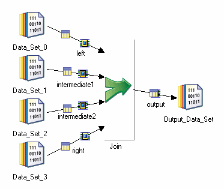
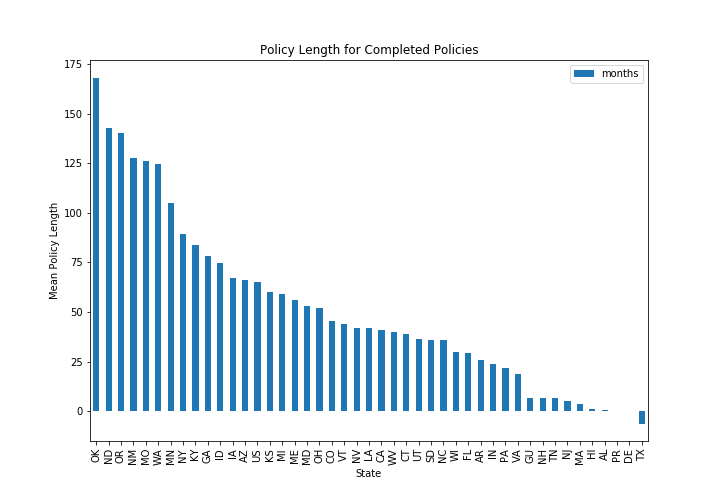
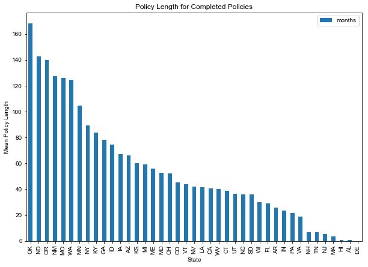
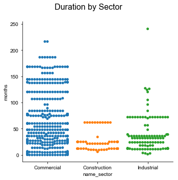
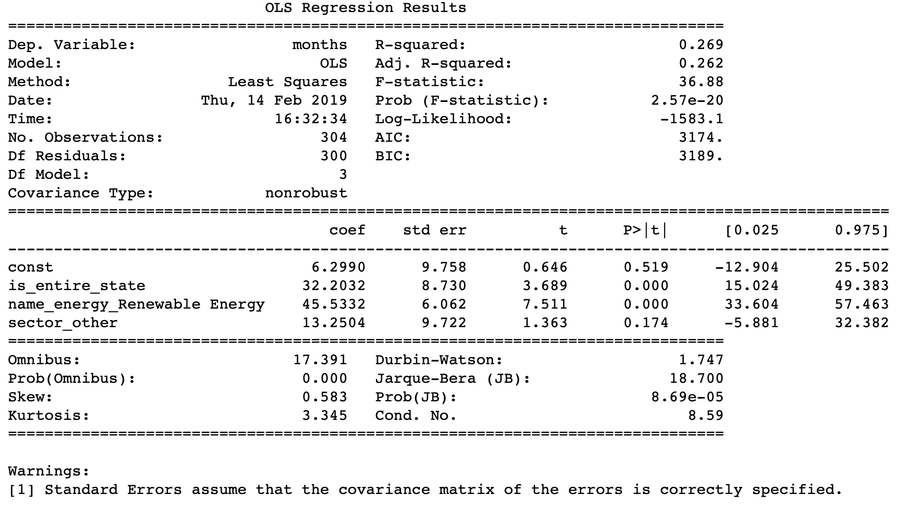
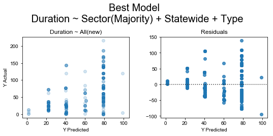
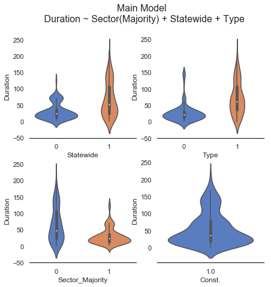
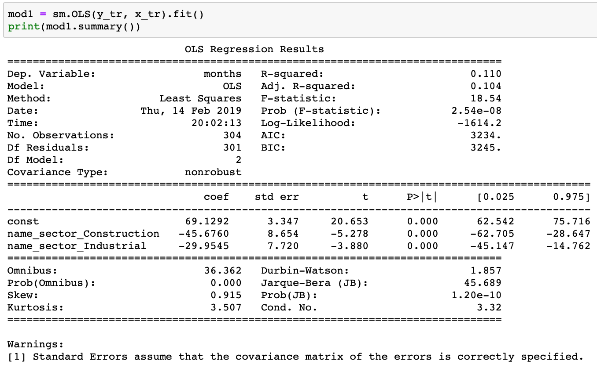
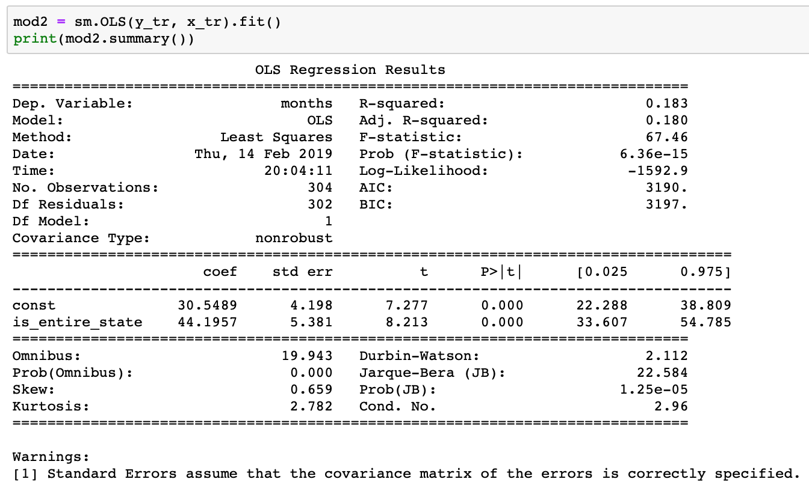
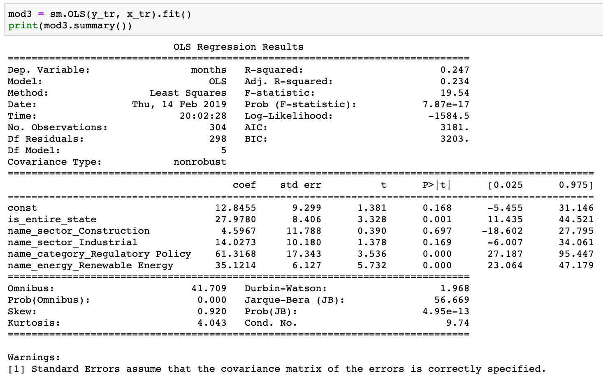

### Renewable Energy Policy Review   
#### By: Derek Lorenzen   
#### Data From: DSIRE, Database of State Incentives for Renewables & Efficiency  
 

#### Question

Can we glean information on renewable energy policies by looking at past completed policies by state?

#### Data Aquisition  
The data source used for this project was DSIRE, a Database of State Incentives for Renewables and Efficiency. DSIRE is operated by North Carolina State University.  

To get the open dataset, one would follow:  
- DSIRE USA (.org) > Resources > Database Archives  

When downloaded, the data is in separate CSV files with an implied schema...

 
(Source: IBM [2])    

Steps:
>Manually Decode Schema   
>Generate Join Sequence  
>Repeat 20 times!

Note: In the end, I generated a clean CSV (pd.to_csv) to limit memory usage.  

#### Data Structure    
 
What to Predict?   

- Budget:  
Database entries were strings with no repetitive structure   

- Duration:  
Needed completed policies with populated 'start' and 'end' variables (also strings, but tame ones)

My finished data contained:   

- State level variables

- Two Time Categories:
> Completed, Ongoing   
>  - Further calculated time delta for completed policies  

- Three Economic Sectors:
>Commercial, Construction, Industrial

- Two Energy Classifiers:
>Renewable Energy, Unit Efficiency

- Two Incentive Structures:
> Regulatory, Incentive

Details: Using the 'Date Created' and 'Date Ended' variables with a mask on a database flag, 'Active', allowed me to calculate a passage of time (months) on _only_ the 'completed' policies

#### Exploratory Data Analysis
 
My Data contains 1 continuous variable, with 5 categorical variables _(and one 'Texas')._

  

Texas secedes from my data...

   

Looking at Duration by Sector, we see highly stratified data.

  

> Interpretation: States tend to pass blanket policies that will cause a recurring duration metric across multiple categories

The violin version of this information alludes more to the 'distribution'

>We notice from this graph that the means of each category may be differentiable.   
Example: The 95% interval for duration on construction is nearly below the lower bound for a commercial policy.

One issue encountered was sparse data after categories were made.

  

> I decided to remove the technology classifier in favor of energy type.

Looking at the data in a correlation matrix we see the energy type is quite correlated.

   

#### Initial Linear Models (Sprints)
 
Graphing predicted outcome versus actual outcome shows major stratification and poor distributions but a generally positive trend for each model.

   

#### Initial Model Statistics
(Model Information in 'Extras')
- Duration ~ Sector
>- R^2 = 0.110
>- Constant: 69.2, P>|t| = 0.000
>- Construction: -45.7, P>|t| = 0.000
>- Industrial: -29.9, P>|t| = 0.000

- Duration ~ Statewide
>- R^2 = 0.183
>- Constant: 30.5, P>|t| = 0.000
>- Statewide: 44.2, P>|t| = 0.000

- Duration ~ All
>- Adj R^2 = 0.247
>- Constant: 12.85, P>|t| = 0.168
>- Statewide: 27.98, P>|t| = 0.001
>- Construction: 4.60, P>|t| = 0.697
>- Industrial: 14.02, P>|t| = 0.169
>- Regulatory: 61.32, P>|t| = 0.000
>- Ren. Energy: 35.12, P>|t| = 0.000

#### Final Model & Interpretation
 
Sector was dominantly 'Business'...
> Aggregate 'Construction' and 'Industrial' into 'minority/other'

Only 6 entries for 'Regulatory' versus 405 for 'Incentive'...
> Remove these from the model

Performing these changes yields...

> ...Heavy correlation but a less sparse dataset.

> We notice some distributions existing for our endogenous variable.

OLS Regression: Duration ~ Sector(Majority) + Statewide + Energy Type

- The confidence interval on the constant term (base case) spans zero and does not conform to a 0.05 confidence level.
>- Baseline generally tends to 6 month duration but with high standard error

- The strongest correlation that passes a confidence interval test (in both validity and threshold) is Renewable Energy (opposed to Appliance Efficiency)
>- This suggests a jump in mean policy length for renewable energy policies of around 45 months

- Another strong correlation is with our Statewide variable.
>- If statewide, we may see a jump in policy length of around 32 months.

- An aggregated sector approach was inconclusive.
>- The confidence interval spans zero but at a significant probability.

Evaluating the predicted duration versus the actual duration, we find a slightly positive relationship.

>We notice the residuals are _passingly_ horizontal.

Further, we can see the deciding distributions with a 'catplot()'

## Thank you for your time!

#### Extras  
 

  

  

  

##### References:  
Galvanize Instructors  
> Thank You!!

IBM Join Image:
>https://www.google.com/url?sa=i&rct=j&q=&esrc=s&source=images&cd=&cad=rja&uact=8&ved=2ahUKEwik9pSCzbzgAhWKhVQKHfHkBIkQjRx6BAgBEAU&url=https%3A%2F%2Fwww.ibm.com%2Fsupport%2Fknowledgecenter%2Fen%2FSSZJPZ_11.5.0%2Fcom.ibm.swg.im.iis.ds.parjob.dev.doc%2Ftopics%2Fc_deeref_Join_Stage.html&psig=AOvVaw1JYbb3HkEoYOruE0weo-wB&ust=1550280996674819
